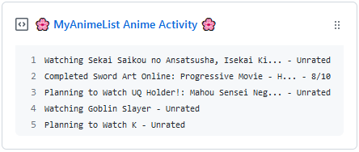

  
  <h3 align="center">MAL-Box</h3>
  
Pinnable GitHub Gist with your latest

***

## 🎉 Usage

### 🚧 Prep Work

1. Create a new public GitHub Gist (https://gist.github.com/).
2. Create a token with the `gist` scope and copy it. (https://github.com/settings/tokens/new)
3. Copy your username from MyAnimeList.

### 🔨 Setup

1. Fork this repository.
2. Go to your fork's **Settings > Secrets** page add the following secrets:
    - **`GH_TOKEN`** - The GitHUb token you saved earlier.
    - **`MAL_USERNAME`** - Your MyAnimeList username.
    - **`GIST_ID`** - The ID of the gist url: `https://gist.github.com/<github username>/`**`<gist ID>`**.
3. **Thats it!** Now you can pin the gist to your profile and every 30 minutes the gist will be updated.
