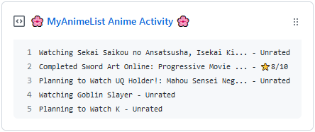
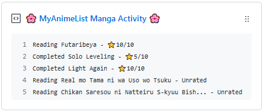

  
  
  <h3 align="center">MAL-Box</h3>
  
Pinnable GitHub Gist with your latest Activity from MyAnimeList

***

## 🎉 Usage

### 🚧 Prep Work

1. Create a new public GitHub Gist (https://gist.github.com/).
2. Create a token with the `gist` scope and copy it. (https://github.com/settings/tokens/new)
3. Copy your username from MyAnimeList.

### 🔨 Setup

1. Fork this repository.
2. Go to your fork's **Settings > Secrets** page add each environment secret (below).
3. Go to your fork's `Actions` tab and enable the `mal-box-default` workflow.
4. **Thats it!** Now you can pin the gist to your profile and every 30 minutes the gist will be updated.

**How to use both Manga and Anime lists:**

1. Do everything from above steps in setup.
2. Go to your fork's **Settings > Environments > New environment** and create two new environments called "manga" and "anime".
3. Choose your "manga" environment and add each environment secret (below). Remember that the `GIST_ID` and `MAL_MODE` will differ from the "anime" environment.
4. Choose your "anime" environment and add each environment secret (below). Remember that the `GIST_ID` and `MAL_MODE` will differ from the "manga" environment.
5. Go to the `Actions` tab on your fork.
5. If enabled, disable the "mal-box-default" workflow by clicking on it and then **Three dots > Disable Workflow** .
6. Enable the "mal-box-anime" Workflow via the same `Actions` tab. Start a workflow run by **Actions > mal-box-anime > Run Workflow**.
7. Enable the "mal-box-manga" Workflow via the same `Actions` tab. Start a workflow run by **Actions > mal-box-manga > Run Workflow**.
8. **Thats it!** Now you can pin the gists to your profile and every 30 minutes both gists will be updated.

### 🤫 Environment Secrets

- **`GH_TOKEN`** - The GitHub token you saved earlier.
- **`MAL_USERNAME`** - Your MyAnimeList username.
- **`GIST_ID`** - The ID of the gist url: `https://gist.github.com/<github username>/`**`<gist ID>`**.
- **`MAL_MODE`** - Select the mode from two options: `anime` or `manga`.